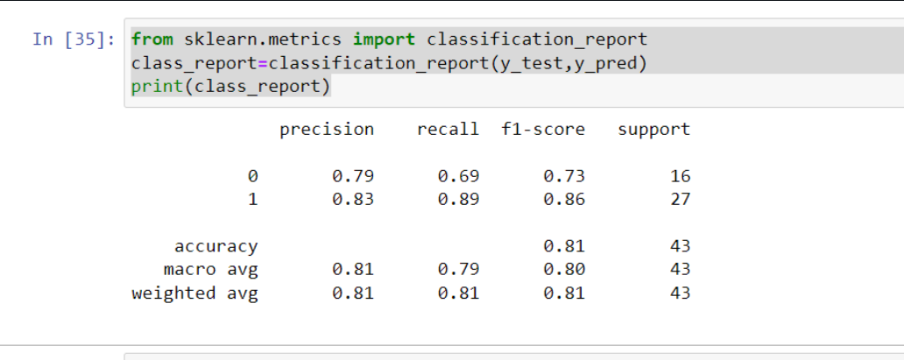

# Implementation-of-Logistic-Regression-Model-to-Predict-the-Placement-Status-of-Student

## AIM:
To write a program to implement the the Logistic Regression Model to Predict the Placement Status of Student.

## Equipments Required:
1. Hardware – PCs
2. Anaconda – Python 3.7 Installation / Moodle-Code Runner

## Algorithm
1. Import pandas library to read CSV or excel files.
2. Import LabelEncoder using sklearn.preprocessing library.
3. Transform the data's using LabelEncoder.
4. Import Logistic regression module from sklearn.linear_model library to predict the values.
5. Find accuracy, confusion matrix ,and classification report using sklearn.metrics library.
6. Predict for the new given values. End of the program. 

## Program:
```
/*
Program to implement the Logistic Regression Model to Predict the Placement Status of Student.
Developed by: Aakash S
RegisterNumber:  212221240001
*/
import pandas as pd
data=pd.read_csv("Placement_Data.csv")
data.head()
data1=data.copy()
data1=data1.drop(["sl_no","salary"],axis=1)
data1.head()
data1=data.copy()
data1=data1.drop(["sl_no","salary"],axis=1)
data1.head()
data.isnull().sum()
data1.head()
data.duplicated().sum()
from sklearn.preprocessing import LabelEncoder
le=LabelEncoder()
data1["gender"]=le.fit_transform(a1["gender"])
data1["ssc_b"]=le.fit_transform(a1["ssc_b"])
data1["hsc_b"]=le.fit_transform(a1["hsc_b"])
data1["hsc_s"]=le.fit_transform(a1["hsc_s"])
data1["degree_t"]=le.fit_transform(a1["degree_t"])
data1["workex"]=le.fit_transform(a1["workex"])
data1["specialisation"]=le.fit_transform(a1["specialisation"])
data1["status"]=le.fit_transform(a1["status"])
print (data1)
x=data1.iloc[:,:-1]
y=data1["status"]
from sklearn.model_selection import train_test_split
x_train,x_test,y_train,y_test=train_test_split(x,y,test_size=0.2,random_state=0)
from sklearn.linear_model import LogisticRegression
c=LogisticRegression(solver="liblinear")
c.fit(x_train,y_train)
y_pred=c.predict(x_test)
print(y_pred)
from sklearn.metrics import accuracy_score
acur=accuracy_score(y_test,y_pred)
acur
from sklearn.metrics import confusion_matrix
con=confusion_matrix(y_test,y_pred)
print(con)
from sklearn.metrics import classification_report
class_report=classification_report(y_test,y_pred)
print(class_report)
print(c.predict([[1,80,1,90,1,1,90,1,0,85,1,85]]))
```

## Output:

### data.head():

### ACCURACY:

### CONFUSION MATRIX:

### CLASS REPORT:

### PREDICTION(Y):

### FINAL PREDICTION:


## Result:
Thus the program to implement the the Logistic Regression Model to Predict the Placement Status of Student is written and verified using python programming.
